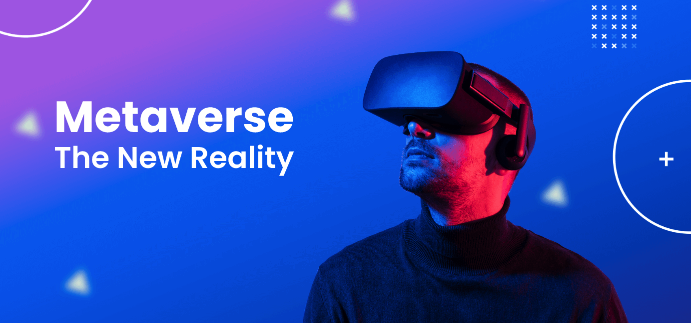

# **Speech Emotion Recognition** - Using Voice Clips to Identify User Sentiment with Python
### Code by Nicholas Wertz
#### Flatiron School Capstone Project  

----

# Table of Contents
#### Overview
#### Business Understanding
#### Data Understanding
#### Modeling
#### Evaluation
#### Conclusion
#### Repository Navigation

---

## Overview

  
In this senario, Meta (formerly Facebook) has been seeing a decline in the time customers spend using their their new virtual reality game/chat room, Horizon  Worlds. Meta has contacted our consulting firm and has made given us the challenge of engaging their players, keeping them in the game for longer.

## Business Understanding

With the recent surge of popularity of Virtual Reality chat rooms, such as Meta's Horizon Worlds, there have been more people using online avatars in live chats. However, emotional expression is lost as these avatars cannot currently retain a static expression chosen upon creation, and do not actively reflect the emotional states of users. With this disconnect of emotion to expression, users are more distant from each-other, less engaged with content, and therefore, less loyal to a particular service. 

Our firm beleives that by creating a model that can perform audio emotion tracking, we can map the resulting emotional readings to the each player's avatar. By mapping the results in game characters, we can increase engagement from user to user and foster a greater sense of community within your platform, and therefore build greater customer loyalty.

## Data Understanding

All voice data clips used were provided by [The Emotional Voices Database (EmoV-DB)](https://arxiv.org/abs/1806.09514), an open-sourced emotional speech database intended to to be used for synthesis and generation of emotion detection and simulation programs. This dataset consists of audio recordings of 5 actors (4 in English and 1 in French) speaking phrases simulating once of 5 possible emotions. The emotions of simulated by the actors were: Anger, Amusement, Disgust, Neutral, Sleepiness. To avoid an imbalance due to their being only 1 French speaking actor in the dataset, I only utilized the recordings of the 4 English speaking actors. The English EmoV-DB files  can be found [at this link.](https://mega.nz/folder/KBp32apT#gLIgyWf9iQ-yqnWFUFuUHg/folder/mYwUnI4K)

# Graphs and here

# Describe Audio processing here

## Modeling

Our final model

## Evaluation

CM- 

## Conclusion

## Repo Navigation 
├──[ images/ ](https://github.com/njw27/SER_Capstone/tree/main/images) <--------------------Directrory of all images Used For Project   
├──[ models_pkls/ ](https://github.com/njw27/SER_Capstone/tree/main/model_pkls) <-------------- Directrory of all `.pkl` files from modeling   
├──[ .gitignore ](https://github.com/njw27/SER_Capstone/blob/main/.gitignore) <------------------ Git Ignore for Project Repo    
├──[ README.md ](https://github.com/njw27/SER_Capstone/blob/main/README.md) < -------------- README.md that you are currently reading  
├──[ SER_Notebook.pdf ](https://github.com/njw27/SER_Capstone/blob/main/SER_Notebook.pdf) <-------- PDF of Final Jupyter Notebook    
├──[ SER_Notebook.ipynb ](https://github.com/njw27/SER_Capstone/blob/main/SER_Notebook.ipynb) <------ Final Project Jupyter Notebook  
├──[ Presentation.pdf ]() <---------- PDF of Project Presentation  

