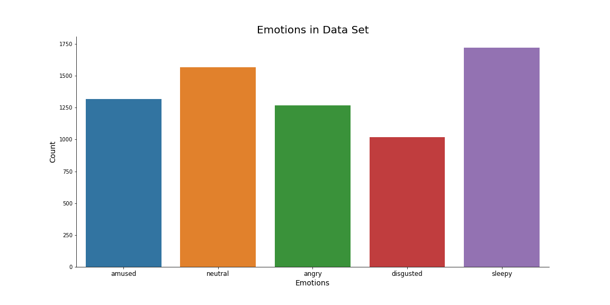
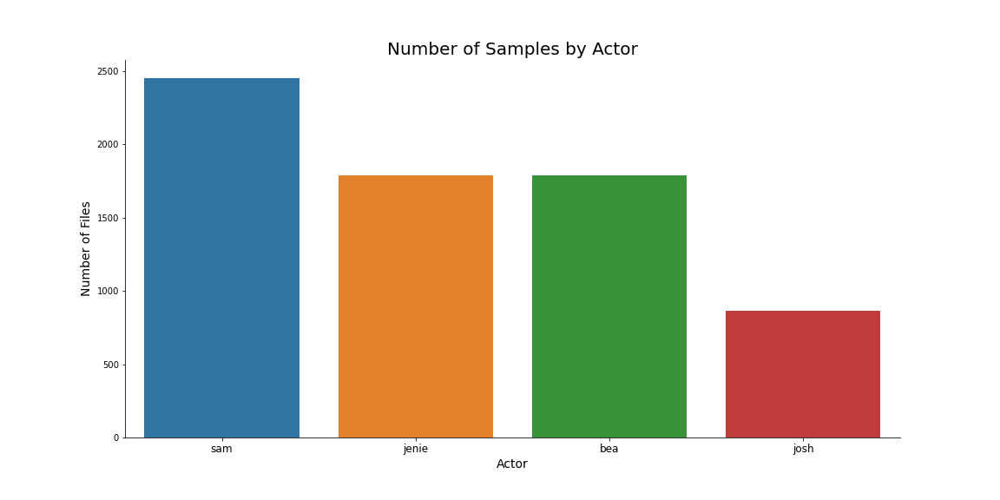
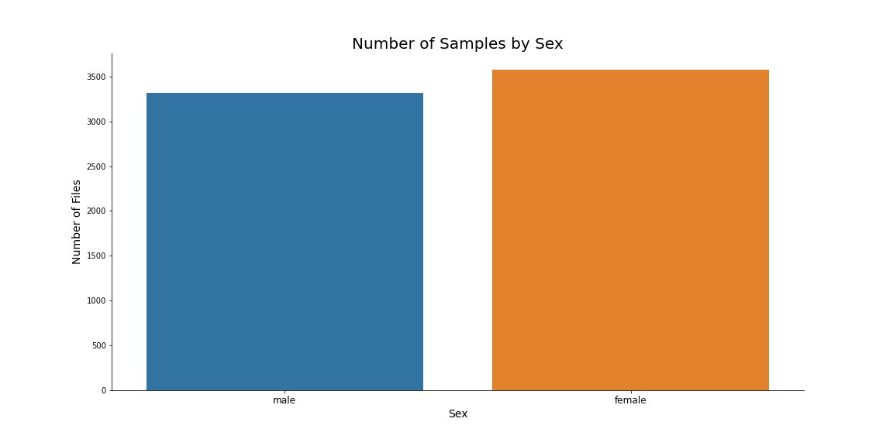
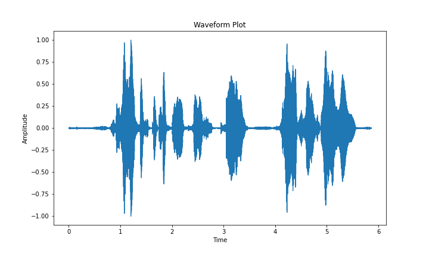
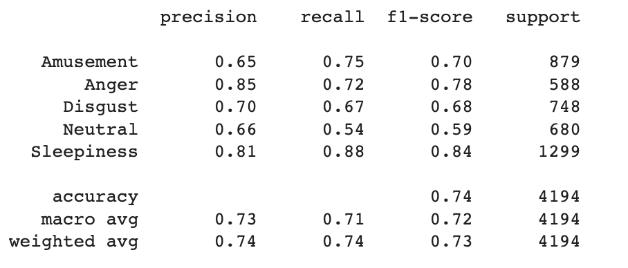
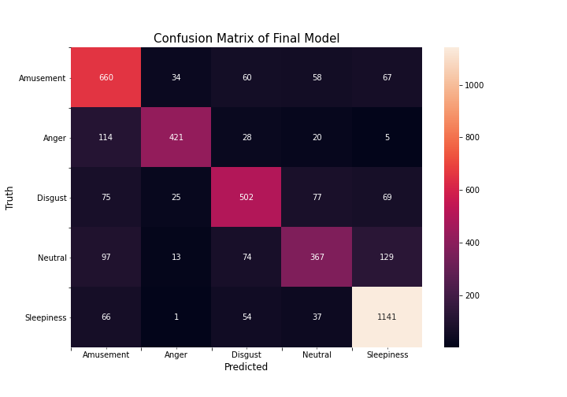

# **Speech Emotion Recognition (SER)** - Using Voice Clips to Identify User Sentiment with Python
### Code by Nicholas Wertz
#### Flatiron School - Capstone Project 
Presentation Available on [Canva](https://bit.ly/3JR2BX9)

----

# Table of Contents
#### Overview
#### Business Understanding
#### Data Understanding
#### Modeling
#### Evaluation
#### Conclusion
#### Repository Navigation

---

## Overview

  
In this scenario, Meta (formerly Facebook) has been seeing a decline in the time customers spend using their new virtual reality game/chat room, Horizon  Worlds. Meta has contacted our consulting firm and has given us the challenge of engaging their players, keeping them in the game for longer.

## Business Understanding

With the recent surge in popularity of Virtual Reality chat rooms, such as Meta's Horizon Worlds, there have been more people using online avatars in live chats. However, emotional expression is lost as these avatars cannot currently retain a static expression chosen upon creation, and do not actively reflect the emotional states of users. With this disconnect of emotion to expression, users are more distant from each-other, less engaged with content, and therefore, less loyal to a particular service. 

Our firm believes that by creating a model that can perform audio emotion tracking, we can map the resulting emotional readings to the each player's avatar. By mapping the results to game characters, we can increase engagement from user to user and foster a greater sense of community within the platform, and therefore build greater customer loyalty.

## Data Understanding

All voice data clips used were provided by [The Emotional Voices Database (EmoV-DB)](https://arxiv.org/abs/1806.09514), an open-sourced emotional speech database intended to to be used for synthesis and generation of emotion detection and simulation programs. This dataset consists of audio recordings of 5 actors (4 in English and 1 in French) speaking phrases simulating once of 5 possible emotions. The emotions of simulated by the actors were: Anger, Amusement, Disgust, Neutral, and Sleepiness. To avoid an imbalance due to their being only 1 French speaking actor in the dataset, I only utilized the recordings of the 4 English speaking actors. The English EmoV-DB files  can be found [at this link.](https://mega.nz/folder/KBp32apT#gLIgyWf9iQ-yqnWFUFuUHg/folder/mYwUnI4K)

As you can see there are a total of 6,893 sound files of English speakers in the EmoV-DB dataset. The data set does not have an even number of all emotions expressed. Sleepiness has the most representation, with over 1700 files, and disgust has the least with just over 1000. While this is a slight imbalance, I do not believe it will massively affect our modeling process.

Looking at the actors who recorded our audio files, Jenie and Bea both have recorded almost 1800 clips each, while Josh only recorded 863. However, Sam recorded nearly 2500 clips to prevent an imbalance in the sexes recoding the audio.

Once all audio clips were identified, they had to be processed for use in a Convolutional Neural Network. First, all silence in the audio files were trimmed with a function utilizing `librosa.effects.trim`. This removed any signal lower than 30 dB's from each audio file. 

Next, the audio recordings were broken up into two second clips and split into training and testing data. The training data was augmented in order to introduce random noise, speed, and pitch variability. This was to simulate the variability of human voices and recording equipment in an attempt to further generalize our training data. The testing data remained as is in order to see how the CNN models perform on fairly clean data.

Finally, each two second audio clip was converted into a better visual representation using librosa's `melspectrogram` and `specshow` to create a Mel Spectrogram. 

A Mel Spectrogram is a representation of an audio signal converted to the "Mel Scale", a scale of frequency that is more representative of human hearing. The librosa functions have essentially done three transformations to our audio files. First, it performs a fast Fourier transform to analyze the frequency content of a signal over time. Librosa then converts these frequencies to the Mel scale, before finally plotting the mel spectrogram of our audio signal over time. The distinct visual patterns of the resulting Mel Spectrogram are what will be into our CNN to train our models.

## Modeling

The first baseline model consisted of a 10 node 2D convolution layer that was then flattened, and output with a five node output layer, using a softmax activation function. This model passed through the data only once. The baseline model was able to correctly predict the class of 2 second audio clip 51% of the time.

The final model added several additional 2D convolution layers and max pooling layers. The resulting model was accurate to nearly 74% and had a loss of only 0.7659.
Below are the precison, recall and F1-score for each emotional class.

## Evaluation

While our final model has an excellent multiclassification test accuracy of nearly 74%, the final model does seems to have a weakness when it comes to the Neutral class. For audio files expressing a Neutral emotion, our model had a precision of 66% and a recall of 54% for a total F1 score of 59%. However, this will not be too much of an issue for mapping emotion to user's avatars, as they can be set to default to a neutral state when no sound is being input.

Due to the large amount of sleepiness data, our final model is excellent at identifying sleepiness in users, with a precision of 81% and a recall of 88%. With an F1 score of 84%, our final model will be able to identify sleepiness in nearly 17 of every 20 users!

  
For the confusion matrix above: 0 = Amusement , 1 = Anger, 2 = Disgust, 3 = Neutral, 4 = Sleepiness

## Conclusion

We can use our model's strengths to the advantage of our client, by suggesting that our client's software performs additional actions when sleepiness is detected. For example, after displaying user emotions on their avatar, our client can have their software perform actions that will draw the attention of the sleepy user, keeping them engaged with their software longer.

Possible future improvements:
- Closely balance the emotional data
- Collect user audio to continuously improve the model
- Expand the dataset to incorporate a variety of languages and accents

## Repo Navigation 
├──[ images/ ](https://github.com/njw27/SER_Capstone/tree/main/images) <------------------------------------Directrory of all images Used For Project   
├──[ models_pkls/ ](https://github.com/njw27/SER_Capstone/tree/main/model_pkls) <------------------------------ Directrory of all `.pkl` files from modeling   
├──[ .gitignore ](https://github.com/njw27/SER_Capstone/blob/main/.gitignore) <---------------------------------- Git Ignore for Project Repo    
├──[ README.md ](https://github.com/njw27/SER_Capstone/blob/main/README.md) < ------------------------------ README.md that you are currently reading  
├──[ SER_Notebook.pdf ](https://github.com/njw27/SER_Capstone/blob/main/SER_Notebook.pdf) <------------------------ PDF of Final Jupyter Notebook    
├──[ SER_Notebook.ipynb ](https://github.com/njw27/SER_Capstone/blob/main/SER_Notebook.ipynb) <---------------------- Final Project Jupyter Notebook  
├──[ Presentation_SER_Capstone.pdf ](https://github.com/njw27/SER_Capstone/blob/main/Presentation_SER_Capstone.pdf) <---------- PDF of Project Presentation  

